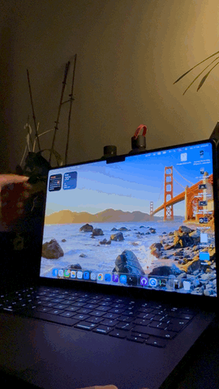

# Lid Up

The iPhone Duo folding animation, recreated for the MacBook Pro lid.

Close the lid and the desktop stays anchored in space while the glass sweeps
through it: the picture tilts, frosts over and slips into black before the
hinge shuts. Open it back up before the Mac sleeps and it returns the same way.

<p align="center">
  
</p>
<p align="center"><a href="docs/lidup-duo.mp4">Full-quality video</a></p>

## Requirements

- A MacBook with the continuous lid angle sensor (M2 MacBook Air or later,
  14/16-inch MacBook Pro with M1 Pro or later). Tested on a 16-inch M5 Max.
- macOS 15 or later. Xcode 27 to build.

## Permissions

Exactly one: **Screen Recording**. ScreenCaptureKit needs it to hand the app a
live copy of the built-in display while the lid moves. Frames stay in GPU
memory for the length of the fold and are never written or sent anywhere.

The lid angle itself is read from the hinge sensor over IOKit HID, which macOS
exposes without any prompt. Launch at login is opt-in and uses the standard
Login Items entry.

macOS ties the Screen Recording grant to the app's code signature. The project
signs with an Apple Development identity so the grant survives rebuilds; with
ad-hoc signing every build would need it granted again.

## Install from the DMG

1. Download `LidUpAnimation-<version>.dmg` from the
   [latest release](https://github.com/hemal08ce094/LidUpAnimation/releases/latest),
   open it, and drag **Lid Up** into **Applications**.
2. Open it. Release DMGs are signed with Developer ID and notarized by Apple,
   so there is no security dialog.
3. Grant **Screen Recording** when the app asks, then relaunch it.

Building the DMG: `./build-dmg.sh` archives a Release build, exports it with
the team's Developer ID certificate, wraps it in a DMG, submits it to Apple's
notary service using the `LidUp` keychain profile
(`xcrun notarytool store-credentials LidUp …`), staples the ticket and writes
`dist/LidUpAnimation-<version>.dmg` plus a SHA-256 file. `SIGN_IDENTITY=-`
builds an ad-hoc DMG instead; the GitHub Actions workflow produces one of
those as a build artifact for every `v*` tag, and users of it need
**Privacy & Security → Open Anyway**.

## Build and run

Open `LidUpAnimation.xcodeproj` in Xcode and run, or:

```sh
xcodebuild -project LidUpAnimation.xcodeproj -scheme LidUpAnimation \
  -configuration Release -derivedDataPath build -destination 'platform=macOS' build
open build/Build/Products/Release/LidUpAnimation.app
```

The app lives in the menu bar. The first launch explains the permission and
asks for it. **Preview the fold** plays a scripted lid sweep without moving
the lid; before Screen Recording is granted it plays over the desktop
wallpaper instead of the live screen.

## Tuning

| Setting | What it does | Default |
|---|---|---|
| Anchor angle | The picture anchors where the lid rests, but never above this. Closing past it starts the fold; opening past it clears it. | 100° |
| Starts after | Degrees the lid must move from rest before the fold begins, when resting below the anchor. | 2° |
| Fully dark at | Lid angle where the picture is completely black. | 25° |
| Viewing distance | Eye distance in screen heights. Smaller exaggerates the perspective. | 2.5 |
| Blur | Gaussian radius at full fold, in points. | 90 |
| Darkening | How dark the picture gets. | 1.0 |
| Clear when still | Hand the screen back after the lid holds still. | on, 2 s |

## Limits

- The opening animation only plays when the Mac did not sleep. After a full
  close macOS shows the lock screen, and nothing can draw over it without
  disabling System Integrity Protection.
- Only the built-in display is animated. In clamshell mode the app idles.
- Clicks pass straight through the overlay.

## Development aids

- `LidUpAnimation --render-check <dir>` writes PNGs of the fold over generated
  artwork at a series of lid angles, without any permission.
- `LidUpAnimation --preview` plays the sweep 1.5 s after launch; posting the
  distributed notification `com.hemalmodi.LidUpAnimation.preview` plays it on
  a running app. Add `--capturable` to let screenshots include the overlay.
- Diagnostics: `log stream --predicate 'subsystem == "com.hemalmodi.LidUpAnimation"'`

See `NOTICE.md` for attribution.
